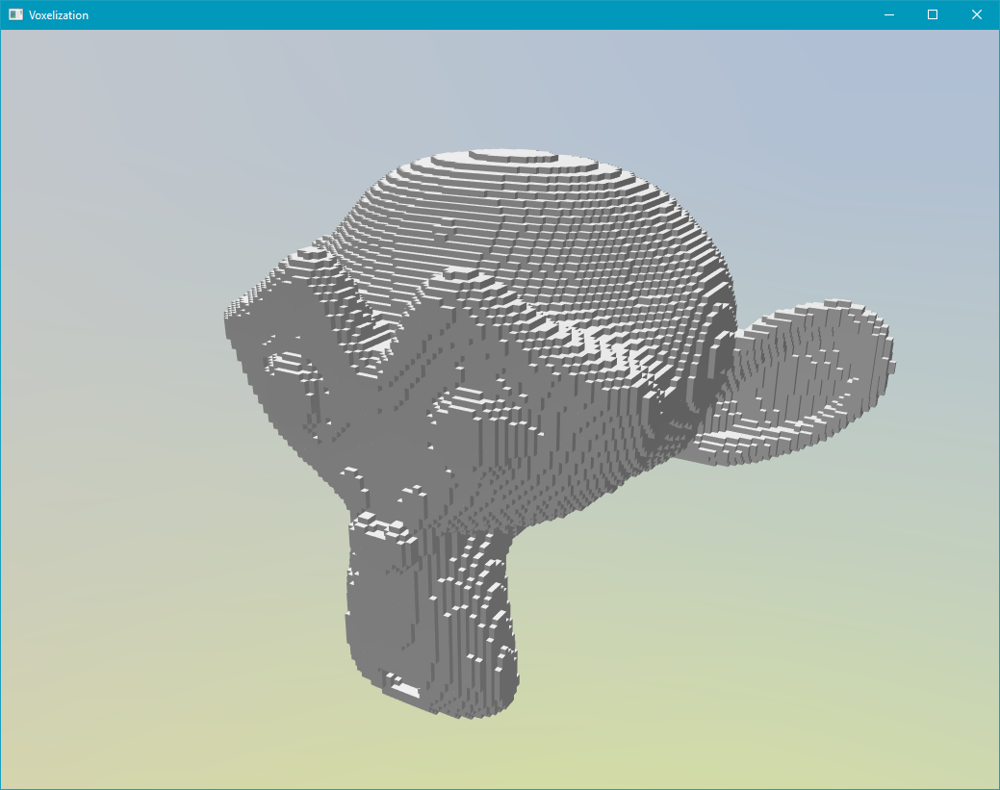

# voxelizer-gpu
Mesh surface thin voxelization using GPU hardware rasterization.
Uses OpenGL 3.3+ core profile.

# Usage
Use the mouse left button to navigate, LShift+ mouse left button to move the light.

Press O or P to decrease/increase precision.

# Screenshots

# Performance
I performed my tests with my integrated Intel HD 4400 under both Linux and Windows. Interestingly, under Linux the computation was faster but at the cost a few glitches and a lower highest supported resolution.

The model used is Suzanne (31,000 vertices).

Grid size:
* 64x64x64: 2 ms
* 128x128x128: 9 ms
* 256x256x256: 10 ms
* 512x512x512: 120 ms

With a 1,000,000 vertices model, the 128x128x128 grid computation takes 45 ms.

# Algorithm
This project uses OpenGL 3.3. Due to the lack of random texture writes, I have to proceed in several passes and use the hardware rasterization, adjusting near and far planes.

For better performance I store the grid in a compact grid (1 bit / voxel). Thanks to this I can proceed 32 slices at a time.

# Compilation
To compile this project requires SFML 2.3.2 and GLEW to compile (see Makefile).

